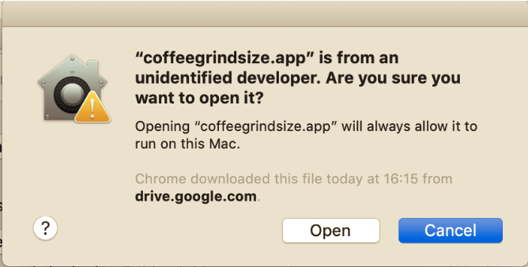
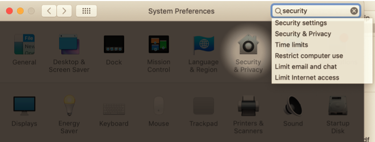
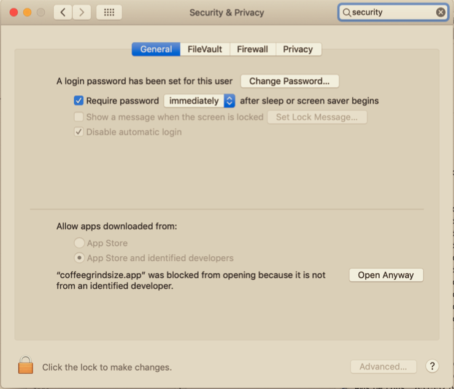
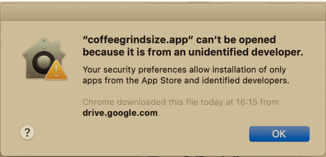

# Coffee Grind Size User Manual. 

You can download this instructions [here](./Help/coffee_grind_size_installation.pdf).

## Downloading the app

You can download [the latest release here](https://github.com/jgagneastro/coffeegrindsize/releases/latest).

After downloading, you can place this file anywhere. (e.g., in your `/Applications` directory). 

## Installing the app

The first time you try to open it by double-clicking, you will get the following error message, because I am an _evil_ non-registered Apple developer.

There is a workaround for this problem. You need to open your computer’s System Preferences by clicking on the Apple logo on the upper left corner of your screen, then choose System Preferences. This will get you here:

The next step is to go in “Security & Privacy” (highlighted above), and make sure you are in the “General” tab:

Note how something new appeared in this options window: there’s a message about "coffeegrindsize.app" having been blocked from running because I’m not an Apple Developer. 

You can allow it to open anyway by clicking “Open Anyway” (it is possible that you will need to click on the locker symbol on the lower left window and enter your admin password first).

Once you did this, you can go back to the .app file, and double-click it again. You will get one last warning:

But this time, you can choose “Open”, in which case you will not need to do any of this next time you open the app !

After installing, please make sure you read the [user manual](./Help/coffee_grind_size_manual.pdf).

### [coffeeadastra.com](https://coffeeadastra.com/2019/04/07/an-app-to-measure-your-coffee-grind-size-distribution-2/)

## Building the app

- `virtualenv venv`
- `. ./venv/bin/activate`
- `pipenv install`
- `python setup.py py2app`